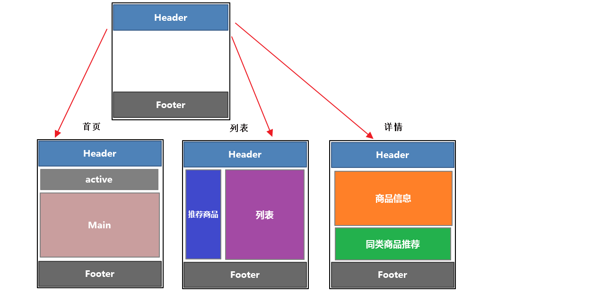

模板继承
===

---

* **模板继承可以减少页面内容的重复定义，实现页面内容的重用**
* 典型应用：网站的头部、尾部是一样的，这些内容可以定义在父模板中，子模板不需要重复定义
* block标签：在父模板中预留区域，在子模板中填充
* **extends继承：继承，写在模板文件的第一行**
* 定义父模板base.html

    ```html
    { %  block block_name  % }
    这里可以定义默认值
    如果不定义默认值，则表示空字符串
    { %  endblock  % }
    ```

* 定义子模板index.html

    ```html
    { %  extends "base.html"  % }
    ```

* 在子模板中使用block填充预留区域

    ```html
    { %  block block_name  % }
        实际填充内容
    { %  endblock  % }
    ```

### 说明

* 如果在模版中使用extends标签，它必须是模版中的第一个标签
* 不能在一个模版中定义多个相同名字的block标签
* 子模版不必定义全部父模版中的blocks，如果子模版没有定义block，则使用了父模版中的默认值
* 如果发现在模板中大量的复制内容，那就应该把内容移动到父模板中
* 使用可以获取父模板中block的内容
* 为了更好的可读性，可以给endblock标签一个名字

    ```html
    { %  block block_name  % }
        区域内容
    { %  endblock block_name  % }
    ```

### 三层继承结构

* 三层继承结构使代码得到最大程度的复用，并且使得添加内容更加简单
* 如下图为常见的电商页面

    

* #### 1.创建根级模板

    * 名称为“base.html”
    * 存放整个站点共用的内容

        ```html
        <!DOCTYPE html>
        <html>
            <head>
                <title>{ %  block title  % }{ %  endblock  % } 水果超市</title>
            </head>
            <body>
                top--
                <hr/>
                { %  block left  % }

                { %  endblock  % }

                { %  block content  % }

                { %  endblock  % }
                <hr/>
                bottom
            </body>
        </html>
        ```

* #### 2.创建分支模版

    * 继承自base.html
    * 名为“base_*.html”
    * 定义特定分支共用的内容
    * 定义base_goods.html

        ```html
        { %  extends 'temtest/base.html'  % }

        { %  block title  % }商品{ %   endblock   % }

        { %  block left  % }
            <h1>goods left</h1>
        { %  endblock  % }
        ```

    * 定义base_user.html

        ```html
        { %  extends 'temtest/base.html'  % }

        { %  block title  % }用户中心{ %  endblock   % }

        { %  block left  % }
            <font color='blue'>user left</font>
        { %  endblock  % }
        ```

    * 定义index.html，继承自base.html，不需要写left块

        ```html
        { %  extends 'temtest/base.html'  % }

        { %  block content  % }
            首页内容
        { %  endblock content  % }
        ```

* #### 3.为具体页面创建模板，继承自分支模板

    * 定义商品列表页goodslist.html

        ```html
        { %  extends 'temtest/base_goods.html'  % }
        { %  block content  % }
            商品正文列表
        { %  endblock content  % }
        ```

    * 定义用户密码页userpwd.html

        ```html
        { %  extends 'temtest/base_user.html'  % }
        { %  block content  % }
            用户密码修改
        { %  endblock content  % }
        ```

* #### 4.视图调用具体页面，并传递模板中需要的数据

    * 首页视图index

        ```python
        logo='welcome to itcast'
        def index(request):
            return render(request, 'temtest/index.html', {'logo': logo})
        ```

    * 商品列表视图goodslist

        ```python
        def goodslist(request):
            return render(request, 'temtest/goodslist.html', {'logo': logo})
        ```

    * 用户密码视图userpwd

        ```python
        def userpwd(request):
            return render(request, 'temtest/userpwd.html', {'logo': logo})
        ```

* #### 5.配置url

    ```python
    from django.conf.urls import url
        from . import views
        urlpatterns = [
            url(r'^$', views.index, name='index'),
            url(r'^list/$', views.goodslist, name='list'),
            url(r'^pwd/$', views.userpwd, name='pwd'),
        ]
    ```